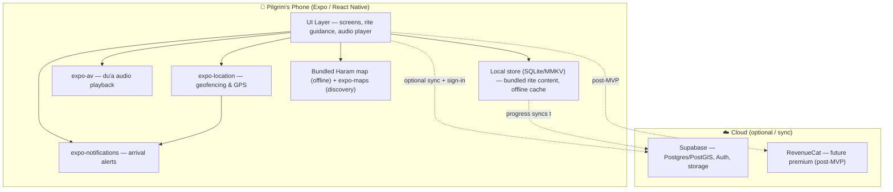

# PRD — Minaroute · Manasik pilgrimage mode

> **Product note:** This PRD specifies the **Manasik pilgrimage mode** — the MVP build — which ships inside the existing **Minaroute** everyday shell (Home / Explore / Trips / Review) as the Trips tab + a full-screen takeover. Everyday discovery and the community directory already exist and are reused (the directory also powers the "halal places near the Haram" layer). See `docs/product-architecture.md` for the full merged definition and how the shell and mode connect.

> **Note on visual design:** Visual tokens (colors, typography, spacing, component styling) are **not** defined in this PRD — they live in **`docs/design.md`** (generated). Use those tokens for all styling. Key references: `primary` deep emerald `#12664F`, `accent` warm sand `#C79A54`, Satoshi (UI) + Amiri (Arabic) type, the `xs→pill` rounded ramp, and components like `button-primary`, `card`, `card-flat`, `counter`, `dua-block`, `chip`, `bottom-sheet`. This PRD references those token and component names directly.

## 1. Overview

### Product Summary

**Manasik** is a location-aware companion that prepares Muslims for Hajj and Umrah from home and guides them through every rite on the ground. It combines an at-home preparation experience (countdown, checklist, packing list, learning modules) with on-the-ground, geofenced rite guidance that detects when a pilgrim arrives at a site and surfaces exactly what to do — the intention, the du'a with audio and transliteration, counts, duration, and the next step — all scholar-verified, offline-capable, and in the pilgrim's language.

### Objective

This PRD covers the **Umrah-first MVP** as scoped in `docs/product-vision.md` § Product Strategy. The MVP is built by a solo, part-time, designer-founder using Claude Code, and targets a usable prototype for friends traveling for Umrah within 90 days. In scope: onboarding + travel dates (no forced account), pre-trip prep (countdown/checklist/packing/learning modules), the complete scholar-verified Umrah rite sequence with audio and counting, location-triggered guidance with a manual fallback, progress tracking + next step, basic wayfinding between Umrah sites, offline core, and English (architected for more languages). Full Hajj, the local-business marketplace, family/social features, group-leader tools, and payments are explicitly out of scope for the MVP.

### Market Differentiation

Technically, Manasik must deliver what no existing tool combines: an experience that spans the whole journey (prepare-at-home → guide-on-ground) and reacts to the pilgrim's physical location, working reliably offline in the densest crowds on earth. The implementation therefore prioritizes (1) an offline-first content architecture where the entire Umrah rite set and maps are bundled on-device, (2) reliable geofencing with a manual fallback so the "it knows I'm here" moment never depends solely on GPS, and (3) trustworthy, scholar-verified, structured rite content rendered in a calm, audio-first UI.

### Magic Moment

Two linked moments: the **primary** magic moment is at home — within minutes of install the pilgrim sees a personalized countdown and plan and feels "I've got this." The **secondary** is on the ground — arriving at a site and being told, unprompted, exactly what to do. Technically: onboarding to personalized home must be fast (< 2 minutes, no account required); geofence-to-rite must be near-instant and work offline; audio must play reliably; counting must be effortless (large tap targets or motion, glanceable).

### Success Criteria

Time from install to personalized home screen < 2 minutes with no sign-in. Complete Umrah rite sequence performable end-to-end fully offline (airplane mode) with zero network errors on the core path. Geofence trigger (or manual "I'm here") opens the correct rite in < 2 seconds. Audio for every du'a plays offline. All P0 functional requirements implemented and manually tested by at least one real pilgrim. App cold-start < 3 seconds on a mid-range Android device.

## 2. Technical Architecture

### Architecture Overview



The core path is **offline-first**: rite content, du'a audio, and the Haram map are bundled on-device so the app works with no signal. The cloud (Supabase) is used for the community directory, reviews, and optional cross-device sync of itinerary/progress — never as a hard dependency on the rite path.

> **Stack (locked to Minaroute's existing build).** This PRD's MVP ships inside the existing Minaroute Expo app, which already uses Supabase, Supabase Auth, and expo-maps. The choices below reflect that reality — Supabase (not Convex), Supabase Auth (not Clerk), and expo-maps + a bundled static Haram map (not Mapbox) for MVP. See `docs/minaroute-codebase-notes.md`.

### Chosen Stack

| Layer | Choice | Rationale |
|---|---|---|
| Frontend | React Native (Expo, Expo Router) | Already Minaroute's stack; one codebase for iOS, Android, and web. Largest ecosystem, excellent AI-coding-agent support. |
| Backend | Supabase | Already built and running in Minaroute. Postgres + PostGIS suits the geospatial places directory; storage, realtime, and edge functions included. Pilgrimage tables are simple additions. |
| Database | Supabase Postgres (PostGIS) | Relational + geospatial with Row-Level Security. Powers directory, reviews, itineraries, and progress; rite content is bundled on-device for offline. |
| Auth | Supabase Auth | Same system as Minaroute's admin auth; integrates natively with Postgres RLS; supports anonymous sign-ins that convert to permanent accounts (matches no-forced-account). Apple/Google social login built in. |
| Payments | RevenueCat | Reserved for the future freemium premium tier — standard for cross-platform mobile subscriptions. Not required for the Umrah-first MVP; core guidance and discovery are free. |
| Maps | expo-maps (discovery) + bundled static Haram map (pilgrimage) | expo-maps already powers everyday Explore. Pilgrimage wayfinding uses a bundled static map of the Haram sites + gates — always offline, calm, purpose-built. Add Mapbox with offline tiles later only if full pan/zoom navigation is needed. |

### Stack Integration Guide

**Setup order (within the existing Minaroute app):** (1) The Expo + Expo Router app and Supabase client already exist (`lib/supabase.native.ts` / `.web.ts`). (2) Add the pilgrimage tables to Supabase (SQL migration: `itineraries`, `rite_progress`, `checklist_progress`) with Row-Level Security. (3) Extend Supabase Auth to the user side (email + Apple/Google + anonymous sign-in) — admin auth already uses Supabase Auth. (4) Build the local content layer (bundled JSON + audio assets, plus `expo-sqlite`/MMKV for anonymous progress) so the pilgrimage path works before any cloud call. (5) Use `expo-location` for geofencing and `expo-notifications` for arrival alerts. (6) Build the bundled static Haram map (sites + gates); keep expo-maps for everyday Explore. (7) Defer RevenueCat until premium.

**Known patterns & gotchas:**
- **Offline-first is a design constraint, not a feature.** All core rite content must resolve from on-device assets. Supabase is a sync/enhancement layer for pilgrimage data, never a hard dependency on the rite path. Treat network as optional everywhere on the core flow.
- **Geofencing on iOS/Android needs background location + a foreground-service/notification config.** Use `expo-location`'s `startGeofencingAsync` with a `TaskManager` task. On Android, request `ACCESS_BACKGROUND_LOCATION`; on iOS, request "Always" only if background triggering is needed — otherwise use foreground geofence checks while the app is open. Always pair with a manual "I'm here" fallback.
- **Supabase Auth + RLS:** enforce ownership in the database — every user-owned table (itineraries, progress, reviews) gets RLS policies keyed to `auth.uid()`. Keep most of the app usable while the session is anonymous; use Supabase anonymous sign-in and later link to email/social without losing data.
- **Audio:** bundle du'a audio as app assets; use `expo-av` (or `expo-audio`) with an audio-mode config that allows playback in silent mode and mixes politely. Pre-load audio for the current rite.
- **Bundled Haram map:** ship the pilgrimage site/gate map as on-device data (vector/static) so wayfinding is always offline; no map SDK dependency on the rite path.

**Required environment variables** (Supabase URL/anon key already configured in `lib/supabase.*.ts`):
```
EXPO_PUBLIC_SUPABASE_URL=
EXPO_PUBLIC_SUPABASE_ANON_KEY=
# Server-only (data import / admin scripts, gitignored in .env.local):
SUPABASE_SERVICE_KEY=
GOOGLE_PLACES_API_KEY=
# RevenueCat (post-MVP):
EXPO_PUBLIC_REVENUECAT_IOS_KEY=
EXPO_PUBLIC_REVENUECAT_ANDROID_KEY=
```

### Repository Structure

```
manasik/
├── app/                          # Expo Router (file-based routes)
│   ├── (onboarding)/             # Onboarding + travel-date capture
│   ├── (tabs)/                   # Main tabs: Home, Prepare, Guide, More
│   │   ├── index.tsx             # Home — countdown + next step
│   │   ├── prepare.tsx           # Checklist, packing, learning modules
│   │   ├── guide.tsx             # Rite list / active rite entry
│   │   └── more.tsx              # Settings, language, about
│   ├── rite/[riteId].tsx         # Active rite guidance screen
│   ├── map.tsx                   # Wayfinding
│   └── _layout.tsx
├── src/
│   ├── components/               # UI components (see docs/design.md)
│   │   ├── ui/                   # Primitives (button, card, etc.)
│   │   └── features/             # Rite card, counter, audio player, checklist item
│   ├── content/                  # BUNDLED offline content
│   │   ├── umrah-rites.en.json   # Structured rite data (English)
│   │   ├── learning-modules.en.json
│   │   ├── sites.json            # Site coordinates + geofence radii + gates
│   │   └── audio/                # Du'a audio files
│   ├── lib/
│   │   ├── location/             # Geofencing task, arrival detection, manual fallback
│   │   ├── audio/                # Audio player wrapper
│   │   ├── storage/              # Local progress store (SQLite/MMKV)
│   │   ├── content/              # Content loader + language resolver
│   │   └── supabase/             # Supabase client + queries (pilgrimage)
│   └── theme/                    # Reference docs/design.md tokens (fonts: Quicksand default)
├── lib/                          # (existing) supabase.native.ts / supabase.web.ts
├── supabase/
│   └── migrations/               # SQL: itineraries, rite_progress, checklist_progress + RLS
├── assets/                       # App icons, fonts (Quicksand, Satoshi, Amiri), images
├── app.json / app.config.ts      # Expo config (permissions, plugins)
└── package.json
```
> Note: the above is the pilgrimage-mode addition. It layers onto Minaroute's existing structure (`app/`, `components/`, `lib/`, `constants/`, `hooks/`), it does not replace it.

### Infrastructure & Deployment

Build and distribute with **EAS Build** (Expo Application Services). Use EAS internal distribution / TestFlight (iOS) and internal testing track (Play Console) to get the prototype onto friends' phones for real Umrah testing. Use **Expo OTA updates** (EAS Update) to push content/logic fixes without full store review. Supabase is a managed service (free tier); web already deploys to Vercel. No custom server or CI is required for the MVP; add GitHub Actions running `eas build` on tag later if desired.

### Security Considerations

Auth is optional and light (Supabase Auth). The core app works anonymously (Supabase anonymous session, later linkable); an account only syncs itinerary/progress and enables contributing reviews/listings. Enforce ownership in the database: every user-owned table (itineraries, progress, reviews) has **Row-Level Security** policies keyed to `auth.uid()`, so a user can only read/write their own rows. Store only what's needed — travel dates and rite progress — and avoid collecting precise location history: geofencing evaluates on-device and **does not** transmit continuous coordinates. Follow OWASP Mobile Top 10: no secrets in the bundle beyond the Supabase anon key (safe only if RLS is enforced on every table — audit this), keep the service key server-side (`.env.local`, gitignored), and request the minimum location permission with a clear rationale string.

### Cost Estimate

For the first 6 months at < 1000 users, expected cost is effectively **$0/month** on free tiers, with the only unavoidable spend being developer program fees:

| Service | MVP tier | Est. monthly |
|---|---|---|
| Supabase | Free tier (Postgres, auth, storage within limits) | $0 |
| expo-maps | Uses platform maps (Google/Apple) | $0 |
| Google Places API | Data import only; free/low within credits | ~$0 |
| Expo / EAS | Free plan (limited build credits) or ~$0 | $0 |
| Vercel (web) | Free hobby tier | $0 |
| Apple Developer Program | Required to ship to iOS | ~$99/year (~$8/mo) |
| Google Play Developer | Required to ship to Android | $25 one-time |
| RevenueCat | Free until >$2.5k monthly tracked revenue (post-MVP) | $0 |

## 3. Data Model

Rite/prep content is **bundled on-device** as versioned JSON (see `src/content/`). Supabase stores per-user itinerary and progress (when signed in). Anonymous users keep progress in the local store only, syncing up on sign-in. The existing Minaroute tables (`places`, `events`, `suggestions`) are reused — `places` also powers the "halal places near the Haram" layer. User identity comes from Supabase Auth (`auth.users`); no separate `users` table is needed (use `auth.uid()`), though a `profiles` table can hold `preferred_language` and `preferred_font`.

### Entity Definitions (Supabase Postgres)

```sql
-- profiles — optional per-user prefs (1:1 with auth.users)
create table profiles (
  id uuid primary key references auth.users(id) on delete cascade,
  display_name text,
  preferred_language text not null default 'en',
  preferred_font text not null default 'quicksand',   -- 'quicksand' | 'satoshi'
  created_at timestamptz not null default now()
);

-- itineraries — one active per user (anonymous copy lives in the local store)
create table itineraries (
  id uuid primary key default gen_random_uuid(),
  user_id uuid not null references auth.users(id) on delete cascade,
  pilgrimage_type text not null default 'umrah',       -- 'umrah' | 'hajj' (Hajj later)
  departure_date date,
  arrival_date date,
  umrah_date date,                                     -- planned day to perform Umrah
  created_at timestamptz not null default now(),
  updated_at timestamptz not null default now()
);

-- rite_progress — one row per (user, rite)
create table rite_progress (
  id uuid primary key default gen_random_uuid(),
  user_id uuid not null references auth.users(id) on delete cascade,
  rite_id text not null,                               -- matches bundled content id, e.g. 'tawaf'
  status text not null default 'not_started',          -- 'not_started' | 'in_progress' | 'completed'
  count_completed int,                                 -- circuits/laps done
  started_at timestamptz,
  completed_at timestamptz,
  unique (user_id, rite_id)
);

-- checklist_progress — prep + packing items
create table checklist_progress (
  id uuid primary key default gen_random_uuid(),
  user_id uuid not null references auth.users(id) on delete cascade,
  item_id text not null,                               -- matches bundled checklist item id
  checked boolean not null default false,
  updated_at timestamptz not null default now(),
  unique (user_id, item_id)
);
```

Enable RLS on all four tables with policies `using (auth.uid() = user_id)` / `id` for profiles. **Rite content is NOT a DB table** — it's authored as bundled, versioned JSON (`src/content/umrah-rites.en.json`) with a **required `scholarSource`** per rite, plus `sites.json` — `{ siteId, name, lat, lng, geofenceRadiusM, gates: [{ name, note, lat, lng }] }` — and `learning-modules.*.json`. This keeps the entire rite path offline.

### Relationships

- `auth.users` 1:1 `profiles`, 1:1 `itineraries` (MVP assumes one active itinerary), 1:many `rite_progress` / `checklist_progress` — all `on delete cascade`.
- `rite_progress.rite_id` and `checklist_progress.item_id` reference **bundled content IDs**, not DB foreign keys (content is versioned in the app bundle).
- `places` (existing) feeds the near-Haram marketplace by geolocation (PostGIS radius query around the Haram).

### Indexes

- `itineraries (user_id)` — load the active itinerary.
- `rite_progress (user_id)` + unique `(user_id, rite_id)` — fast per-rite upserts.
- `checklist_progress` unique `(user_id, item_id)` — idempotent toggles.
- `places` — PostGIS GiST index on the location column for "near me" queries (likely already present).

## 4. API Specification

### API Design Philosophy

Direct `supabase-js` calls from the app plus **Postgres Row-Level Security** for authorization — no custom API server. All user-data reads/writes require an authenticated session (RLS: `auth.uid() = user_id`); anonymous users use the local store and sync on sign-in. Map PostgREST/Supabase errors to friendly, gentle copy in the UI (see `docs/product-vision.md` voice guide). No pagination needed at MVP scale. **Rite content is bundled on-device, never fetched at runtime on the rite path.**

### Operations (supabase-js)

```typescript
// RLS enforces user_id = auth.uid(); set user_id via a DB default/trigger so the client never sends it.

// ---- Itinerary ----
supabase.from('itineraries').select('*').maybeSingle();                    // getMine
supabase.from('itineraries').upsert({ pilgrimage_type, departure_date, arrival_date, umrah_date });

// ---- Rite progress ----
supabase.from('rite_progress').select('*');                                // listRites
supabase.from('rite_progress').upsert(
  { rite_id, status, count_completed }, { onConflict: 'user_id,rite_id' });

// ---- Checklist ----
supabase.from('checklist_progress').select('*');                           // listChecklist
supabase.from('checklist_progress').upsert(
  { item_id, checked }, { onConflict: 'user_id,item_id' });

// ---- Profile (language + font prefs) ----
supabase.from('profiles').upsert({ preferred_language, preferred_font });

// ---- Directory (existing Minaroute) ----
supabase.rpc('places_near', { lat, lng, radius_m });   // PostGIS near-me — Explore + near-Haram layer
supabase.from('places').select('*').eq('category', 'Halal Food');
```

**Local-store mirror (no network):** the same operations exist against `expo-sqlite`/MMKV for anonymous users — `getItinerary`, `upsertItinerary`, `getRiteProgress`, `setRiteStatus`, `toggleChecklistItem`. A sync layer reconciles local → Supabase on sign-in (local wins for un-synced progress).

## 5. User Stories

### Epic: Onboarding & Preparation

**US-001: Start without friction**
As Ibrahim, I want to start using the app immediately without creating an account, so that I can see value before committing.
Acceptance Criteria:
- [ ] Given a fresh install, when I open the app, then I reach a personalized home screen after only a warm intro and entering my Umrah/travel dates.
- [ ] Given I skipped sign-in, when I use prep and rite features, then everything works and my progress saves locally.
- [ ] Edge case: I enter no dates → the app still works, showing generic prep with a prompt to add dates for a countdown.

**US-002: Feel ready before I travel**
As Ibrahim, I want a countdown, checklist, packing list, and short learning modules, so that I feel prepared before I leave home.
Acceptance Criteria:
- [ ] Given I set my Umrah date, when I open Home, then I see a countdown and a clear "next thing to do."
- [ ] Given I'm on Prepare, when I tick a checklist/packing item, then it persists across app restarts (offline).
- [ ] Given I open a learning module, when I have no signal, then it still loads (bundled).

### Epic: On-the-Ground Rite Guidance

**US-003: Be told what to do when I arrive**
As Ibrahim, I want the app to detect when I reach a site and show me the right rite, so that I never feel lost.
Acceptance Criteria:
- [ ] Given location permission and I enter a site's geofence, when the app is open (or via notification), then the correct rite screen is offered within 2 seconds.
- [ ] Given weak/no GPS, when I tap "I'm here," then I can manually open the correct rite.
- [ ] Edge case: geofence misfires far from any site → no rite is force-opened; manual selection remains available.

**US-004: Perform a rite correctly, offline**
As Ibrahim, I want step-by-step instructions, the du'a with audio and transliteration, and count tracking, so that I perform each rite correctly.
Acceptance Criteria:
- [ ] Given an active rite, when I view it, then I see ordered steps, du'a (Arabic + transliteration + translation), a play button for audio, and a counter where relevant.
- [ ] Given I'm in airplane mode, when I play the du'a audio, then it plays from bundled assets.
- [ ] Given Tawaf, when I tap the counter each circuit, then it increments to 7 with clear, large, glanceable feedback and marks the rite complete at 7.

**US-005: Always know the next step**
As Ibrahim, I want to mark a rite complete and be shown what's next and which way to go, so that I move smoothly through Umrah.
Acceptance Criteria:
- [ ] Given I complete a rite, when I confirm, then the app shows the next rite and simple directional/gate guidance.
- [ ] Given I open Home mid-journey, then it always shows exactly one clear next step.

### Epic: Wayfinding & Language

**US-006: Find the next site**
As Ibrahim, I want simple guidance to the next site and which gate to use, so that I don't get disoriented in the Haram.
Acceptance Criteria:
- [ ] Given a next site, when I open the map, then I see my position, the destination, and recommended gate — using the bundled offline Haram map.
- [ ] Edge case: no offline tiles downloaded → show a directional arrow + textual gate guidance as fallback.

**US-007: Use it in my language**
As a non-Arabic-speaking pilgrim, I want the app in English (and eventually my language), so that I understand every instruction.
Acceptance Criteria:
- [ ] Given first launch, when I choose a language, then all UI and content render in it (English at MVP).
- [ ] Given the content model, when a new language is added, then no schema change is needed.

## 6. Functional Requirements

**FR-001: Frictionless onboarding** — Priority: P0
Description: Warm intro, language selection, and travel/Umrah date capture leading to a personalized home, with no forced account.
Acceptance Criteria: Reaches home < 2 min; no sign-in required; dates optional but enable countdown.
Related Stories: US-001, US-002, US-007

**FR-002: Offline local progress store** — Priority: P0
Description: Persist itinerary, checklist, and rite progress on-device (SQLite/MMKV) for anonymous users; reconcile to Supabase on optional sign-in.
Acceptance Criteria: All progress survives restart offline; sign-in merges local → cloud without loss.
Related Stories: US-001, US-002, US-004

**FR-003: Pre-trip prep (countdown, checklist, packing, learning)** — Priority: P0
Description: Countdown to Umrah date; checklist and packing list with persistent toggles; bundled bite-size learning modules.
Acceptance Criteria: Items persist offline; modules load offline; countdown reflects the set date.
Related Stories: US-002

**FR-004: Complete Umrah rite content (scholar-verified)** — Priority: P0
Description: Full ordered Umrah sequence — Ihram/intention, Talbiyah, Tawaf (7), two-rak'ah prayer, Zamzam, Sa'i (7), hair-cutting — each with steps, du'a (Arabic/transliteration/translation), audio, counts, duration, and a required scholar source citation.
Acceptance Criteria: Every rite has a citation; content renders offline; sequence order is correct.
Related Stories: US-004, US-005

**FR-005: Location-triggered rite surfacing + manual fallback** — Priority: P0
Description: Geofence key Umrah sites; on arrival, offer the correct rite (via in-app prompt and/or notification). Always provide a manual "I'm here / start this rite" control.
Acceptance Criteria: Geofence or manual selection opens correct rite < 2s; no reliance on network; misfires don't hijack the UI.
Related Stories: US-003

**FR-006: Rite counter (Tawaf/Sa'i)** — Priority: P0
Description: Large, glanceable counter to track circuits/laps; auto-complete at the target count; ability to correct a miscount.
Acceptance Criteria: Increments reliably; supports decrement/undo; marks complete at target.
Related Stories: US-004

**FR-007: Du'a audio playback (offline)** — Priority: P0
Description: Play bundled du'a audio for each rite; works in silent mode; pre-loads current rite.
Acceptance Criteria: Plays in airplane mode; no crash on rapid play/pause.
Related Stories: US-004

**FR-008: Progress tracking + next step** — Priority: P0
Description: Mark rites complete; Home always shows the single next step; a rite list shows done/remaining.
Acceptance Criteria: Next step always correct; state persists offline.
Related Stories: US-005

**FR-009: Basic wayfinding + gate guidance** — Priority: P1
Description: Bundled static Haram map with pilgrim position, next-site destination, and recommended gate; always offline; directional-arrow + gate-text fallback if map data is missing.
Acceptance Criteria: Map loads offline when tiles present; fallback arrow + gate text otherwise.
Related Stories: US-006

**FR-010: Language selection & i18n architecture** — Priority: P1
Description: English at MVP; content and UI structured so additional languages need no schema change.
Acceptance Criteria: Switching language re-renders content; adding a language = adding content files + strings.
Related Stories: US-007

**FR-011: Optional account & cross-device sync (Supabase Auth + Supabase)** — Priority: P1
Description: Optional sign-in to sync itinerary/progress across devices.
Acceptance Criteria: App fully usable signed-out; sign-in syncs without data loss.
Related Stories: US-001

**FR-012: Personalized itinerary** — Priority: P2
Description: Generate a simple day-by-day Umrah plan from travel dates.
Acceptance Criteria: Plan reflects entered dates; editable.
Related Stories: US-002

## 7. Non-Functional Requirements

### Performance
Cold start < 3s on a mid-range Android (e.g. ~4GB RAM). Geofence/manual → rite screen < 2s. Audio start < 500ms (pre-loaded). Bundled content lookups are synchronous/instant. App bundle size kept reasonable (< ~80MB including audio; compress audio, e.g. AAC/Opus).

### Security
OWASP Mobile Top 10 addressed. No secrets beyond the Supabase anon key in the bundle (safe only with RLS enforced). All user-owned tables enforce per-user ownership via Row-Level Security (`auth.uid()`), and inputs are validated client-side (zod) before writes. Location evaluated on-device; continuous coordinates never transmitted. Supabase Auth manages the session; sign-out clears it while local progress is preserved.

### Accessibility
WCAG 2.1 AA intent for mobile: minimum 44×44pt tap targets (counters especially large), dynamic type / scalable fonts, sufficient contrast (verify against `docs/design.md` tokens), screen-reader labels on all controls, and audio as a first-class alternative to reading — critical for low-literacy and non-native users. RTL layout support for Arabic content.

### Scalability
Free-tier Supabase comfortably supports < 1000 users. Offline-first means the rite path never hits the backend, so scaling pressure is minimal. Content updates ship via app releases + EAS Update.

### Reliability
Core rite path has a 100% offline success target (no network dependency). Graceful degradation: if Supabase is unavailable, the app still guides the full Umrah from bundled assets. 99.5% uptime target for the optional sync backend.

## 8. UI/UX Requirements

> **Visual tokens are defined in `docs/design.md`.** Component names below (e.g. `button-primary`, `card`, `card-flat`, `counter`, `dua-block`, `chip`, `bottom-sheet`) refer to that file. Styling values (colors, type, radii, spacing) come from its YAML tokens — do not hardcode.

### Screen: Onboarding
Route: `/(onboarding)`
Purpose: Warm welcome, language choice, capture Umrah/travel dates, reach personalized home — no account required.
Layout: Full-screen sequential steps; large calm typography; single primary action per step.
States: Empty (first step) / In-progress (stepper) / Error (invalid date → gentle inline message) / Complete (transition to Home).
Key Interactions: Select language → content localizes. Pick dates → sets countdown. "Continue" → Home. "Skip" on dates → generic prep.
Components Used: `button-primary`, `date-picker`, `language-select`, `progress-dots`.

### Screen: Home
Route: `/(tabs)/index`
Purpose: Show countdown (pre-trip) or current next step (on-trip); one clear action.
Layout: Header with greeting (voice: "As-salamu alaykum"); prominent countdown or next-step card; quick links to Prepare/Guide.
States: Empty (no dates → prompt to add) / Loading (skeleton card) / Populated (countdown or next rite) / Error (gentle offline reassurance).
Key Interactions: Tap next-step card → active rite. Tap countdown → Prepare.
Components Used: `card`, `next-step-card`, `countdown`, `button-primary`.

### Screen: Prepare
Route: `/(tabs)/prepare`
Purpose: Checklist, packing list, learning modules.
Layout: Sectioned list; progress indicator per section.
States: Empty (all unchecked) / Populated (mixed) / Complete (celebratory but calm) / offline works fully.
Key Interactions: Toggle item → persists offline. Open module → reader/player.
Components Used: `checklist-item`, `section-header`, `module-card`, `progress-bar`.

### Screen: Guide (rite list)
Route: `/(tabs)/guide`
Purpose: See the Umrah sequence, done/remaining, jump into a rite; manual "I'm here."
Layout: Ordered vertical stepper of rites with status badges; sticky "I'm here" button.
States: Not started / In progress / Completed per rite; Error → manual selection always available.
Key Interactions: Tap rite → active rite screen. Tap "I'm here" → nearest/likely rite.
Components Used: `rite-list-item`, `status-badge`, `button-secondary`.

### Screen: Active Rite
Route: `/rite/[riteId]`
Purpose: Guide a single rite — steps, du'a, audio, counter, complete.
Layout: Title + site; step list; du'a block (Arabic/transliteration/translation) with audio; large counter (if applicable); "Mark complete" / "Next" footer.
States: Loading (rare; content is local) / Populated / Completed (shows next step) / Error (offline reassurance).
Key Interactions: Play audio → offline playback. Tap counter → increment (undo available). Mark complete → next rite + direction.
Components Used: `rite-card`, `dua-block`, `audio-player`, `counter`, `button-primary`.

### Screen: Map / Wayfinding
Route: `/map`
Purpose: Navigate to next site; recommended gate.
Layout: Bundled Haram map full-screen (offline); bottom sheet with destination + gate note; fallback panel.
States: Populated (tiles present) / Fallback (arrow + gate text if no tiles) / Loading (locating) / Error (permission denied → instructions).
Key Interactions: Recenter; tap gate → highlight; "Start rite here" when arrived.
Components Used: `map-view`, `bottom-sheet`, `gate-chip`, `direction-arrow`.

### Screen: More / Settings
Route: `/(tabs)/more`
Purpose: Language, optional sign-in, about, sources/credits.
Layout: Grouped list.
States: Signed-out (default, "Sign in to sync") / Signed-in (name shown).
Key Interactions: Change language; toggle font (Quicksand/Satoshi); sign in with Supabase Auth; view scholar sources.
Components Used: `list-row`, `button-secondary`, `language-select`.

### Modal: Arrival Prompt
Trigger: Geofence entry while app is open.
Purpose: Offer the detected rite without hijacking.
Layout: Non-blocking bottom sheet: "You've reached [Site]. Begin [Rite]?" with confirm/dismiss.
Components Used: `bottom-sheet`, `button-primary`, `button-ghost`.

## 9. Auth Implementation

### Auth Flow
Optional, deferred sign-in — the same Supabase Auth already used for admin, now extended to users. Anonymous by default via **Supabase anonymous sign-in** (`supabase.auth.signInAnonymously()`), so a pilgrim can use everything immediately; when they later sign in with email or Apple/Google, the anonymous user is **linked** to the permanent account, preserving their data. On sign-in, run the local→cloud sync.

### Provider Configuration
Use the existing `supabase-js` client (`lib/supabase.native.ts` / `.web.ts`) with the `expo-secure-store` storage adapter already configured. In the Supabase dashboard, enable Email, Anonymous sign-ins, and Apple + Google providers (Apple sign-in is required by the App Store when other social logins exist). No second auth vendor.

### Protected Routes
No routes are hard-gated in the MVP — the whole app works signed-out. Authorization is enforced in the database with **Row-Level Security**: user-owned tables allow reads/writes only where `auth.uid() = user_id`. Anonymous users use the local store; there's nothing to gate client-side.

### User Session Management
Supabase Auth manages the session and refresh tokens via the `expo-secure-store` adapter (`persistSession: true`). Read the session with `supabase.auth.getSession()` / `onAuthStateChange`. On sign-out, clear the session but keep local progress intact so the pilgrim never loses data.

### Role-Based Access
Not needed for the MVP (single user role: pilgrim). Group-leader/agency roles are out of scope and revisited when those features are built.

## 10. Payment Integration

> **No payments in the MVP.** Core guidance is free. This section documents the intended approach for the future freemium tier so it isn't re-litigated later; **implement nothing here for the prototype.**

### Payment Flow
When premium launches, use **RevenueCat** for cross-platform subscriptions (App Store + Play Store IAP). Free users keep full core Umrah guidance; premium unlocks candidate features (e.g. extra languages, advanced/personalized itinerary, richer offline maps) — final gating TBD.

### Provider Setup
Install `react-native-purchases` (RevenueCat) + `react-native-purchases-ui` (optional paywall). Configure products/entitlements in App Store Connect and Google Play Console, then map them to a RevenueCat "entitlement" (e.g. `premium`). Initialize with platform API keys at app start.

### Pricing Model Implementation
Define offerings in RevenueCat (e.g. monthly/annual, or a one-time "trip pass"). Gate features by checking `customerInfo.entitlements.active["premium"]`.

### Webhook Handling
Use RevenueCat webhooks → a Supabase edge function to update a `subscription_status` field if server-side gating is ever needed. For MVP-plus, client-side entitlement checks suffice.

### Subscription Management
Direct users to native subscription management (App Store/Play). Use RevenueCat's `restorePurchases` for reinstalls/device changes. Test with sandbox accounts before release.

## 11. Edge Cases & Error Handling

### Feature: Location / Geofencing
| Scenario | Expected Behavior | Priority |
|---|---|---|
| Location permission denied | App fully usable; rely on manual "I'm here"; gentle explainer offering to enable | P0 |
| Weak/no GPS at site | No auto-trigger; manual selection prominent | P0 |
| Geofence misfire (wrong site) | Never force-open; offer, don't hijack; easy dismiss | P0 |
| Background triggering unavailable (iOS "While Using") | Foreground geofence checks while app open; notify to open app near sites | P1 |

### Feature: Offline / Network
| Scenario | Expected Behavior | Priority |
|---|---|---|
| No signal during rites | Full rite path works from bundle; reassuring copy | P0 |
| Supabase unreachable | Anonymous/local mode continues seamlessly | P0 |
| Bundled Haram map data missing | Fallback directional arrow + gate text | P1 |
| Sync conflict on sign-in | Local un-synced progress wins; no data loss | P1 |

### Feature: Rite Content & Counting
| Scenario | Expected Behavior | Priority |
|---|---|---|
| User miscounts a circuit | Undo/decrement available; correct before completing | P0 |
| App killed mid-rite | Resume with saved count/status on reopen | P0 |
| Audio asset fails to load | Show text du'a; non-blocking error; retry | P1 |
| Content citation missing | Content fails authoring validation; never ships | P0 |

### Feature: Onboarding
| Scenario | Expected Behavior | Priority |
|---|---|---|
| No dates entered | Generic prep + prompt; app still works | P1 |
| Invalid date (past) | Gentle inline validation | P1 |

## 12. Dependencies & Integrations

### Core Dependencies
```json
{
  "expo": "*",
  "expo-router": "*",
  "react": "*",
  "react-native": "*",
  "@supabase/supabase-js": "*",
  "expo-secure-store": "*",
  "expo-location": "*",
  "expo-task-manager": "*",
  "expo-notifications": "*",
  "expo-av": "*",
  "expo-sqlite": "*",
  "expo-maps": "*",
  "react-native-mmkv": "*",
  "i18next": "*",
  "react-i18next": "*",
  "zod": "*"
}
```
(Post-MVP: `react-native-purchases`, `react-native-purchases-ui`.)

### Development Dependencies
```json
{
  "typescript": "^5.x.x",
  "eslint": "^9.x.x",
  "prettier": "^3.x.x",
  "@types/react": "^18.x.x",
  "jest": "^29.x.x",
  "jest-expo": "*",
  "eas-cli": "*"
}
```

### Third-Party Services
- **Supabase** — Postgres/PostGIS, Auth, storage, realtime. Free tier. Uses the URL + anon key already configured; service key stays server-side.
- **expo-maps** — everyday Explore map (platform Google/Apple maps). Pilgrimage wayfinding uses a bundled static Haram map instead (offline).
- **Google Places API** — one-off data import for the directory (server-side script).
- **Expo EAS** — builds, OTA updates, distribution. Free plan (limited credits).
- **Apple Developer Program / Google Play Console** — required to distribute (~$99/yr / $25 one-time).
- **RevenueCat** (post-MVP) — subscriptions. Free under revenue threshold.

## 13. Out of Scope

- **Full Hajj rites & Mina/Arafat/Muzdalifah logistics** — far more complex, seasonal, higher-stakes. Reconsider after Umrah is proven, before the next Hajj season.
- **Local-business marketplace (hotels/restaurants/services)** — the primary monetization idea but needs supply partnerships + user base. Reconsider once there are real, repeat users near the Haram.
- **Family "follow-along" / social features** — adds accounts, real-time infra, privacy scope. Reconsider after core guidance is loved.
- **Group-leader / mutawwif coordination tools** — a different product surface and a B2B wedge. Reconsider alongside agency conversations.
- **Full multi-language localization** — architected for now; only English authored at launch. Add top pilgrim languages once English is validated.
- **Payments / premium tier** — no paid features in MVP; RevenueCat reserved for later.

## 14. Open Questions

1. **Scholarly review & school-of-thought handling.** How will rite content be verified, and how do we present legitimate differences (e.g. across madhhabs)? Options: single-madhhab MVP with clear labeling vs. selectable madhhab. Tradeoff: scope vs. inclusivity. **Recommended default:** ship one clearly-labeled, widely-accepted approach for MVP with citations; add selectable variations later.
2. **Background vs. foreground geofencing.** Full background triggering improves the magic moment but increases permission friction and platform complexity. **Recommended default:** foreground geofencing + notifications while app is open for MVP; evaluate background after real-site testing.
3. **How to test at real sites without traveling.** Rely on friends' trips + a mock-location dev mode. **Recommended default:** build a simulator mode that lets you spoof arrival at each site's coordinates for QA.
4. **Audio sourcing & licensing.** Whose recitation for the du'as, and are rights cleared? **Recommended default:** commission or license clearly-permitted recordings; store as compressed bundled assets.
5. **First non-English language.** Which language after English? **Recommended default:** match the primary language of the first testers / partnering creator's audience (candidates: Urdu, Indonesian, Hausa/Yoruba).
6. **Map data granularity for gates.** How precisely can gates be represented offline? **Recommended default:** curate a small hand-built `sites.json` with gate coordinates + notes for the key Umrah locations rather than relying on generic map POIs.
